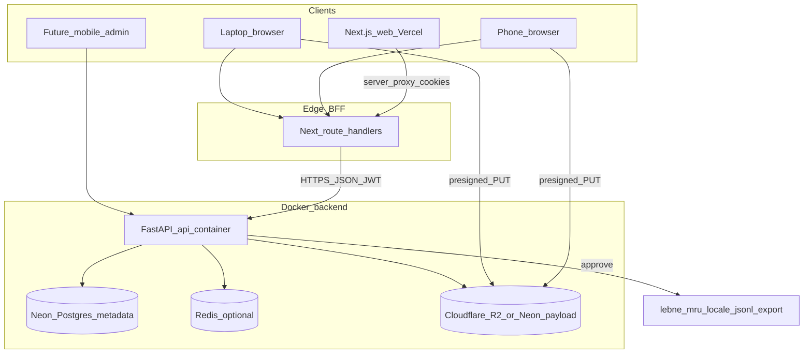

# Crowdsource platform — long-term architecture



## Layers

| Layer | Role | Scale path |
|-------|------|------------|
| **web/** | UI only (React). Auth cookies via Next BFF. | Vercel |
| **api** (Docker) | Source of truth: crowd users, 45k prompts, submissions, progress, wallet later | Render / Fly / K8s |
| **Postgres** | Real data store for all crowd + wallet tables | Managed Postgres in prod |
| **Export** | Approved rows → `lebne_mru_*.jsonl` for QLoRA | Cron / admin action |

## Contribute UX contract

1. Queue walks **all ~45k file rows** — only the **human utterance** (`messages.user` / words & questions). Do **not** surface imported AI boilerplate assistants (`SAFE_REPLIES`).
2. **fr / ar / en** are *view tabs only* — re-render that **same** utterance (file text when `source_locale` matches; else cached MT of that text). Never load another prompt.
3. Contributors write **Hassaniya** for that utterance, optional **voice**, then **Next**. FAQ answers come later.
4. Progress is tracked only for `locale=hassaniya`.

## API surface (stable)

Base: `/crowd/v1`

- `POST /auth/register` · `POST /auth/login` · `GET /auth/me`
- `GET /prompts/next?view=en|fr|ar` · `GET /prompts/{id}/view?view=`
- `POST /submissions` (Hassaniya Q+A + optional `audio_path`)
- `POST /stt` (save clip; Whisper draft if keyed)
- `GET /progress` · `GET /admin/users` · `GET /admin/pending` · `POST /admin/review`
- `POST /admin/users/{id}/role` — Owner only; body `{ "role": "reviewer" | "contributor" }`
- Inbox excludes the actor’s own rows; **decline** deletes that contributor’s Hassaniya progress for the item.

### Roles, limits, Hassaniya export

| Role | Access | Review limit | Export |
|------|--------|--------------|--------|
| **owner** | Inbox + People (grant/revoke reviewer) | Unlimited | Approve once → export immediately |
| **reviewer** | Inbox only | **100** approve/decline actions per UTC day | Export when **3 distinct reviewers** approve the **same** Hassaniya text |
| **contributor** | Contribute only | — | — |

- Bootstrap seed: `LEBNE_ADMIN_BOOTSTRAP_EMAIL` → first **owner** (`is_admin` kept as `role == owner` for JWT/UI compat).
- Submission statuses: `pending` → `awaiting_consensus` (after first reviewer approve) → `approved` (exported) or `rejected`.
- If a reviewer **edits** the Hassaniya text, prior approve votes reset (must collect 3 again on the new snapshot).
- Audit log (`contrib_audit_log`): approve, decline, promote, revoke, export.
- Review votes (`contrib_review_votes`): unique per `(submission_id, reviewer_id)` for approve.

Wallet/agent stay under `/v1/*` and `/wallet/v1/*` — same process today, split later if needed.

## Local Docker

```bash
docker compose up -d postgres redis qdrant
docker compose up -d --build api
# Seed full ~45k queue into Postgres (one-shot profile):
docker compose --profile seed run --rm seed
# Or: docker compose exec api python scripts/seed_contrib_queue.py
```

Web (BFF → API; UI colors stay in Next.js):

```bash
cd web
cp .env.example .env
# API_INTERNAL_URL=http://127.0.0.1:8000
# LEBNE admin bootstrap is on the API: LEBNE_ADMIN_BOOTSTRAP_EMAIL
npm run dev
```

## Expansion plan

### 1. Service boundaries & when to split `crowd-api`

**Today:** One FastAPI process mounts `/crowd/v1`, `/v1/*`, `/wallet/v1/*`. Next.js BFF is the only browser-facing client for crowd.

| Boundary | Owner | Rule |
|----------|--------|------|
| Crowd domain | `contrib/*` + `/crowd/v1` | Users, prompts, submissions, review, export |
| Wallet / agent | `wallet/*`, `agent/*` | Never share JWT `aud` with crowd |
| UI | `web/` on Vercel | Cookie session only; no DB access |
| Training artifacts | JSONL export | Approved rows only |

**Split when:** crowd write QPS degrades wallet/chat; deploy cadence diverges; STT/media needs different resources; compliance isolates crowd PII.

**Split shape:** Extract `crowd-api` image (`contrib` + thin entry). Keep one Postgres initially; point BFF `API_INTERNAL_URL` at crowd host. Do not put the prompt queue back into Next/Prisma.

### 2. Data model evolution

- **Voice (shipped):** `contrib_audio_assets` (`id`, `object_key`, `status`, `storage_backend`) + `submissions.audio_id`. Bytes in **Cloudflare R2** when configured, else Neon `contrib_audio_payloads`. Legacy `audio_path` / `contrib_audio_blobs` are migration-only. Clients use `audioId` via `/crowd/v1/audio/*` (presign / complete / multipart / stream). Shared `VoiceRecorder` supports phone + laptop mime fallbacks and file picker.
- **Roles (shipped):** `CrowdUser.role` ∈ `owner` \| `reviewer` \| `contributor`; Owner grants/revokes reviewer; consensus + daily cap as above.
- **Attribution:** contributor + reviewer ids on export; `dataset_tag` on prompts; no emails in training JSONL. Migrate legacy blobs: `python scripts/migrate_audio_blobs_to_assets.py`.

### 3. Deploy path

```text
local Compose → staging (Vercel preview + managed PG + API container)
             → prod (Vercel + managed PG + API on 0.0.0.0:$PORT)
```

Promote schema staging → prod. Never point Vercel prod at staging API. Seed via controlled job only.

### 4. Security

| Token | `aud` | Scope |
|-------|--------|--------|
| Crowd | `lebne-crowd` | `/crowd/v1/*` only |
| Wallet | `lebne-api` | wallet/agent only |

CORS allowlist = Vercel + localhost in dev. Prefer no browser→API in prod (BFF only). Secrets stay on API / Vercel server env — never `NEXT_PUBLIC_*` for JWT/DB.

### 5. Observability

Emit: route latency, auth fail counts, `prompts_remaining` / `submissions_pending`, approve/reject, export batches, STT latency. Health: `/health` + `/crowd/v1/health`. Alert on queue age and `/crowd/v1` 5xx.

### 6. API versioning

- Additive fields OK on `/crowd/v1`.
- Breaking → `/crowd/v2`; BFF pins major version.
- Deprecate ≥ 90 days. Export schema versioned separately for QLoRA.
